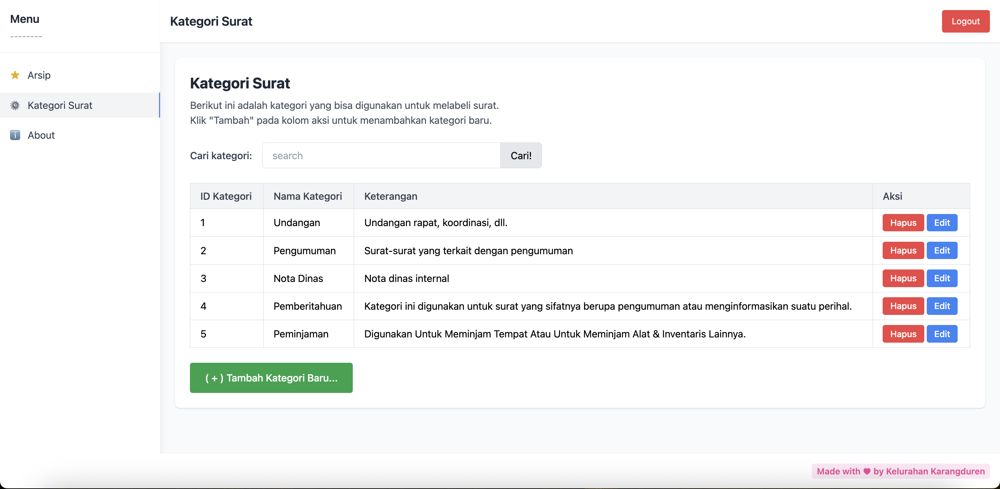

# Aplikasi Arsip Surat Kelurahan Karangduren

Aplikasi web untuk mengelola arsip surat-surat resmi di Kelurahan Karangduren, Kecamatan Pakisaji. Dibangun menggunakan Laravel 12 dengan interface yang user-friendly untuk memudahkan petugas kelurahan dalam mengarsipkan, mencari, dan mengelola dokumen surat.

## 🎯 Tujuan

-   Menyediakan sistem digital untuk pengarsipan surat-surat resmi kelurahan
-   Memudahkan pencarian dan pengambilan dokumen surat
-   Menggantikan sistem arsip manual yang kurang efisien
-   Menyediakan backup digital untuk dokumen penting
-   Meningkatkan produktivitas petugas kelurahan dalam pengelolaan dokumen

## ✨ Fitur Utama

### 🔐 Autentikasi

-   **Login & Register** - Sistem login dengan email dan password
-   **Session Management** - Remember me dan auto logout
-   **User Management** - Registrasi dengan nama lengkap dan username

### 📁 Manajemen Arsip Surat

-   **Upload Surat** - Upload file PDF dengan metadata lengkap
-   **Preview PDF** - Preview dokumen langsung di browser
-   **Download Surat** - Download file PDF ke komputer
-   **Edit Surat** - Edit informasi surat dan ganti file
-   **Hapus Surat** - Hapus surat dengan konfirmasi keamanan

### 🔍 Pencarian & Filter

-   **Pencarian Real-time** - Cari berdasarkan judul dan nomor surat
-   **Filter Kategori** - Filter surat berdasarkan kategori
-   **Sorting** - Urutkan berdasarkan tanggal pengarsipan

### 🏷️ Manajemen Kategori

-   **CRUD Kategori** - Tambah, edit, hapus kategori surat
-   **Kategori Default** - Undangan, Pengumuman, Nota Dinas, Pemberitahuan
-   **Validasi Penggunaan** - Kategori yang digunakan tidak bisa dihapus
-   **Pencarian Kategori** - Cari kategori berdasarkan nama dan keterangan

### 📊 Dashboard

-   **Tampilan Tabel** - Daftar semua surat dalam format tabel
-   **Quick Actions** - Tombol aksi cepat (Lihat, Download, Hapus)
-   **Search Bar** - Pencarian langsung dari dashboard
-   **Responsive Design** - Tampilan optimal di berbagai device

### ℹ️ Halaman Informasi

-   **About Page** - Informasi developer dan aplikasi
-   **Dokumentasi Fitur** - Penjelasan lengkap fitur aplikasi
-   **Technical Info** - Teknologi yang digunakan

## 🛠️ Teknologi yang Digunakan

-   **Backend:** Laravel 12, PHP 8.x
-   **Database:** MySQL/MariaDB
-   **Frontend:** Blade Templates, Tailwind CSS
-   **File Storage:** Laravel Storage (Public Disk)
-   **Authentication:** Laravel Built-in Auth
-   **PDF Handling:** Browser Native PDF Viewer

## 📋 Prasyarat

Sebelum menjalankan aplikasi, pastikan Anda telah menginstall:

-   PHP >= 8.1
-   Composer
-   MySQL
-   Node.js & NPM
-   Web Server (Apache/Nginx) atau Laravel Valet

## 🚀 Cara Menjalankan Aplikasi

### 1. Clone Repository

```bash
git clone https://github.com/username/arsip-surat-kelurahan.git
cd arsip-surat-kelurahan
```

### 2. Install Dependencies

```bash
# Install PHP dependencies
composer install

# Install Node dependencies (jika diperlukan)
npm install
```

### 3. Environment Setup

```bash
# Copy file environment
cp .env.example .env

# Generate application key
php artisan key:generate
```

### 4. Database Configuration

Edit file `.env` dan sesuaikan konfigurasi database:

```env
DB_CONNECTION=mysql
DB_HOST=127.0.0.1
DB_PORT=3306
DB_DATABASE=web_kelurahan
DB_USERNAME=your_username
DB_PASSWORD=your_password
```

### 5. Database Migration & Seeding

```bash
# Buat database baru
mysql -u root -p -e "CREATE DATABASE web_kelurahan"

# Jalankan migration
php artisan migrate

# Jalankan seeder (opsional - untuk data kategori default)
php artisan db:seed --class=CategorySeeder
```

### 6. Storage Setup

```bash
# Buat symbolic link untuk storage
php artisan storage:link

# Buat direktori untuk file surat
mkdir -p storage/app/public/letters
```

### 7. Jalankan Aplikasi

```bash
# Development server
php artisan serve

# Aplikasi akan berjalan di: http://127.0.0.1:8000
```

### 8. Akses Aplikasi

1. Buka browser dan kunjungi `http://127.0.0.1:8000`
2. Klik "Daftar di sini" untuk membuat akun baru
3. Login dengan kredensial yang telah dibuat
4. Mulai gunakan aplikasi untuk mengarsipkan surat

## 📱 Penggunaan Aplikasi

### 1. **Mengarsipkan Surat Baru**

-   Login ke aplikasi
-   Klik tombol "Arsipkan Surat..."
-   Isi form dengan lengkap (Nomor Surat, Kategori, Judul)
-   Upload file PDF (maksimal 10MB)
-   Klik "Simpan"

### 2. **Mencari Surat**

-   Di dashboard, gunakan search bar
-   Ketik kata kunci (judul atau nomor surat)
-   Klik "Cari!" atau tekan Enter
-   Hasil pencarian akan ditampilkan di tabel

### 3. **Melihat Detail Surat**

-   Klik tombol "Lihat >>" pada surat yang diinginkan
-   PDF akan ditampilkan di browser
-   Gunakan tombol "Unduh" untuk download
-   Gunakan "Edit/Ganti File" untuk mengubah data

### 4. **Mengelola Kategori**

-   Pilih menu "Kategori Surat" di sidebar
-   Klik "Tambah Kategori Baru..." untuk menambah
-   Klik "Edit" untuk mengubah kategori
-   Klik "Hapus" untuk menghapus (jika tidak digunakan)

## 📁 Struktur Folder

```
arsip-surat-kelurahan/
├── app/
│   ├── Http/Controllers/
│   │   ├── Auth/
│   │   │   └── AuthController.php
│   │   ├── AboutController.php
│   │   ├── CategoryController.php
│   │   ├── DashboardController.php
│   │   └── LetterController.php
│   └── Models/
│       ├── User.php
│       ├── Category.php
│       └── Letter.php
├── database/
│   ├── migrations/
│   └── seeders/
│       └── CategorySeeder.php
├── resources/
│   └── views/
│       ├── auth/
│       ├── categories/
│       ├── letters/
│       ├── layouts/
│       ├── about.blade.php
│       └── dashboard.blade.php
├── storage/
│   └── app/
│       └── public/
│           └── letters/
└── routes/
    └── web.php
```

## 🔒 Keamanan

-   **File Upload Validation** - Hanya menerima file PDF
-   **File Size Limit** - Maksimal 10MB per file
-   **Authentication Required** - Semua fitur memerlukan login
-   **CSRF Protection** - Semua form dilindungi CSRF token
-   **Input Validation** - Validasi server-side untuk semua input
-   **SQL Injection Prevention** - Menggunakan Eloquent ORM

## 🐛 Troubleshooting

### Problem: Storage Link Error

```bash
# Solution:
php artisan storage:link --force
```

### Problem: Permission Denied

```bash
# Solution:
chmod -R 775 storage/
chmod -R 775 bootstrap/cache/
```

### Problem: Database Connection Error

-   Periksa konfigurasi database di file `.env`
-   Pastikan MySQL service sudah running
-   Cek username/password database

### Problem: File Upload Error

-   Periksa permission folder `storage/app/public/letters`
-   Pastikan symbolic link sudah dibuat
-   Cek PHP configuration untuk `upload_max_filesize`

### Screenshot





**Dibuat dengan ❤️ untuk Kelurahan Karangduren**
# Web_Surat_Kelurahan
